# Variables

## seed
Setting a seed value will generate a tree with random effects but it will be fixed.  Every unique number should make a new tree.  The same seed will generate the same tree.  Setting to 0 will create a random tree every time and there will be no way to capture the output.
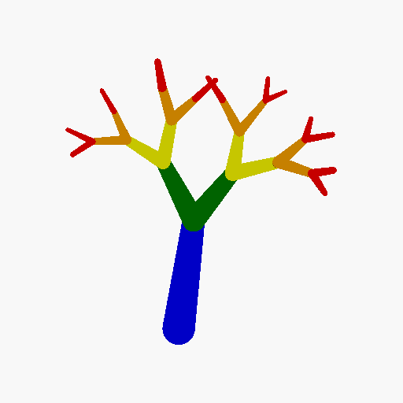

## levels
How many levels to create.
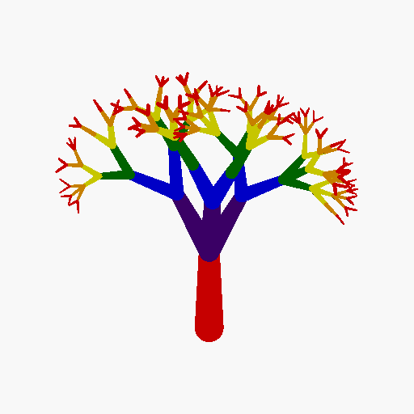

## randomness
Multipler for all randomizers.  Setting to 0 will disable all randomizers.
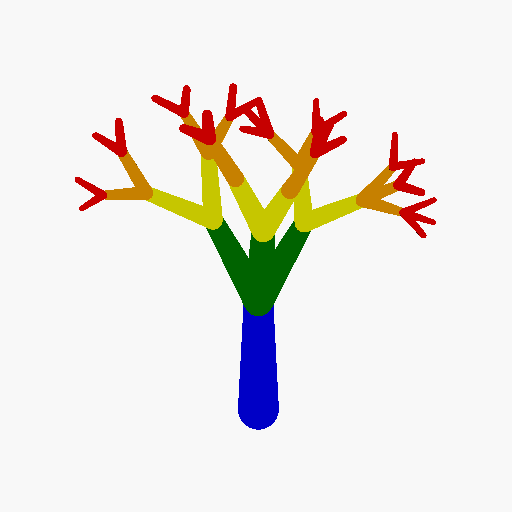
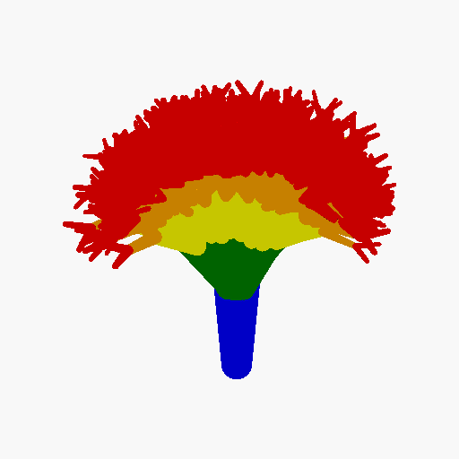

## spread
Base spread of child branches.
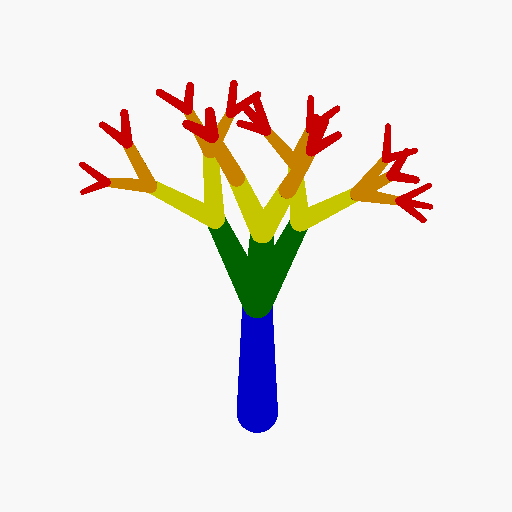
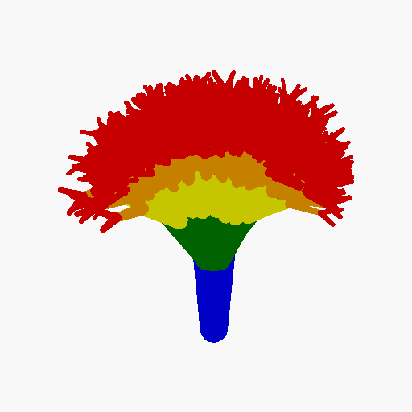

## spread_variance
How much to allow random rolls to impact angle of child branches.
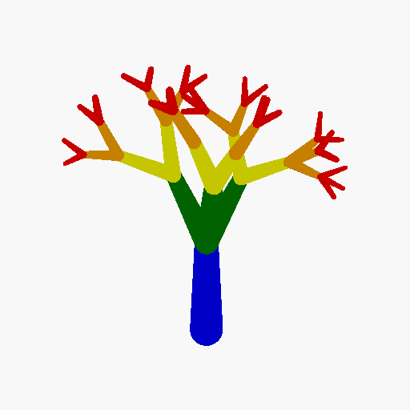

## angle_cutoff
This will limit the maximum angle a branch can go.  If this is exceeded no children are spawned.
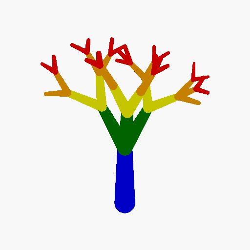

## height
Height of the first branch.
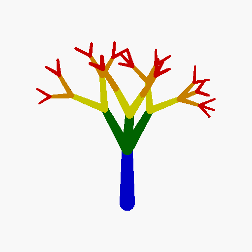

## height_divider
Determines how much smaller children branches are.
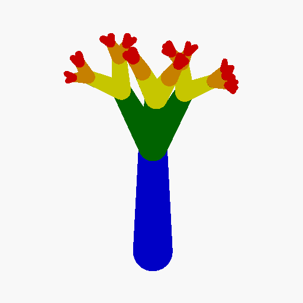
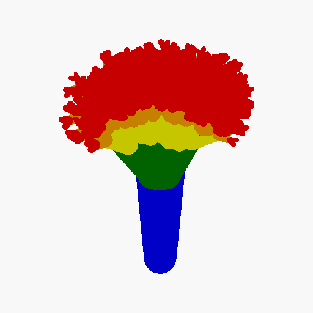

## height_variance
How much the height randomenss roll will impact the height divider.
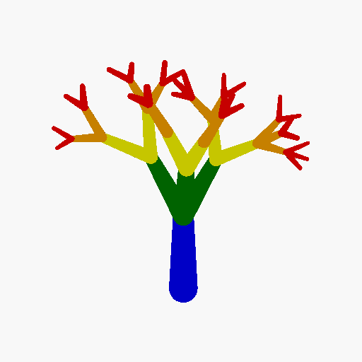
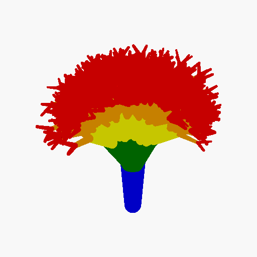

## root
Diameter of base of first branch.
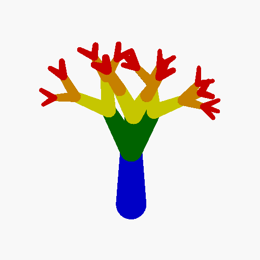
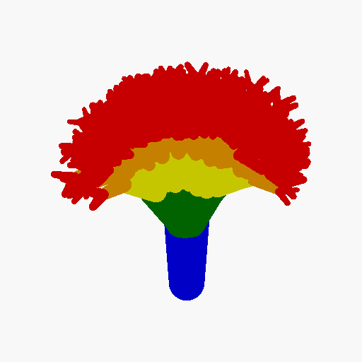

## taper
Difference between the diameter at the base of the branch and the diameter at the tip.
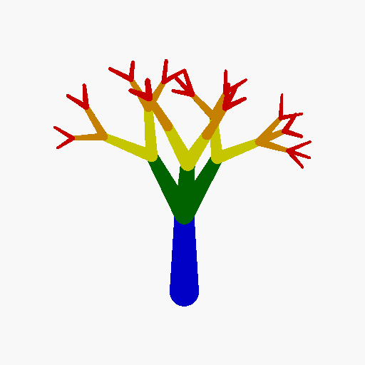
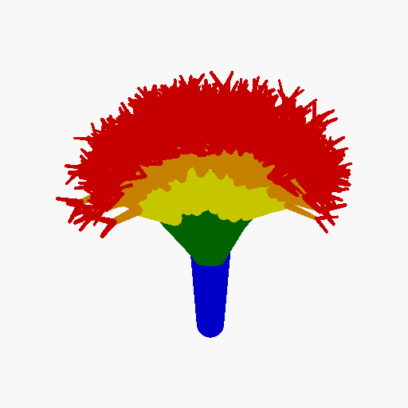

## taper_variance
How much to allow random rolls to impact taper.
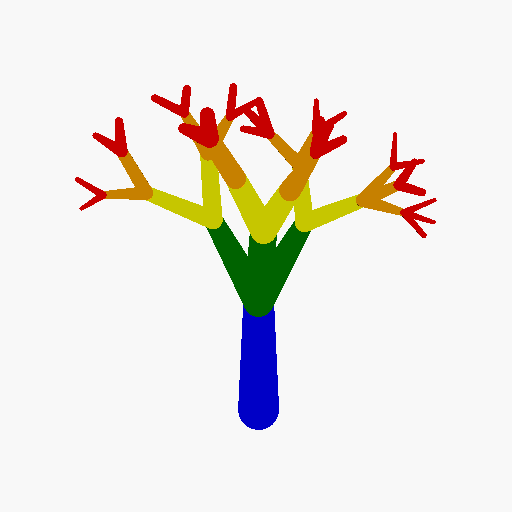
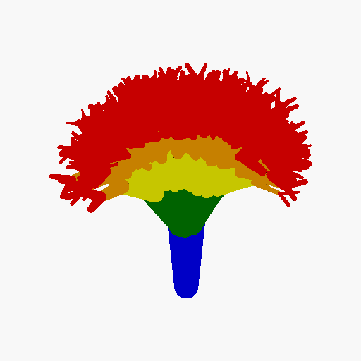
